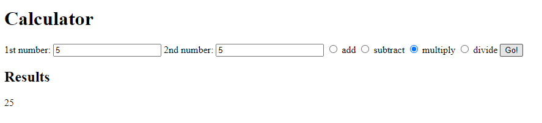

# Calculator

**By Rosemary Ojwang**

*An App that performs basic arithmetic calculations.*

## Technologies Used
* HTML
* CSS
* JavaScript

## Description
*This is an application that allows a user to enter two number and select an arithmetic operation they want done on the numbers. It then produces the results.*

## Set-up/Installation Requirements
1. Clone this repository to your desktop.
2. Navigate to the top level of the directory.
3. Open index.html in your browser.

 

## License
[MIT](https://opensource.org/license/mit/)

_Copyright (c) 2023._ _**Rosemary Ojwang**_